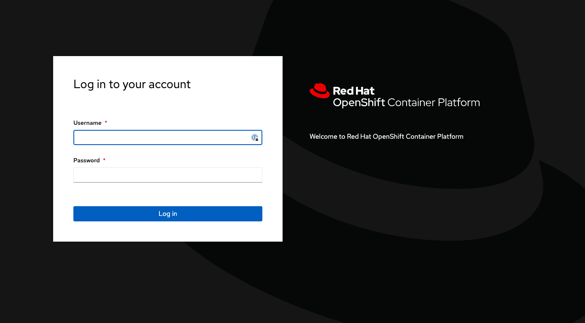
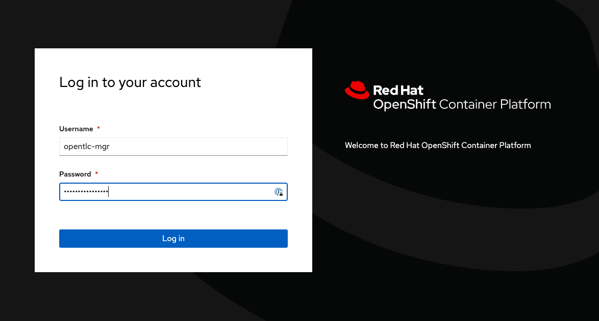
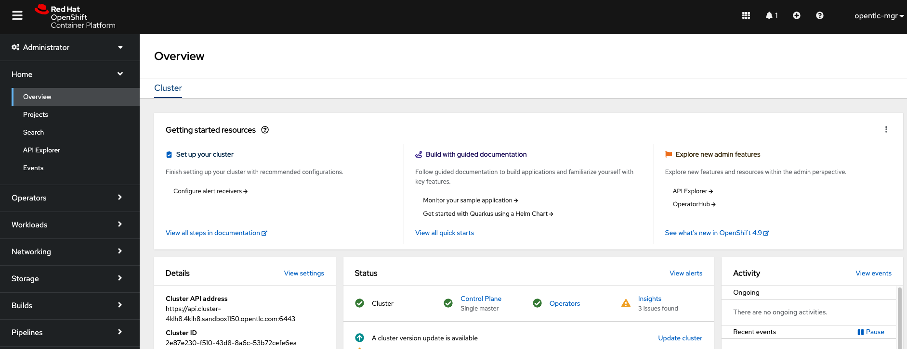
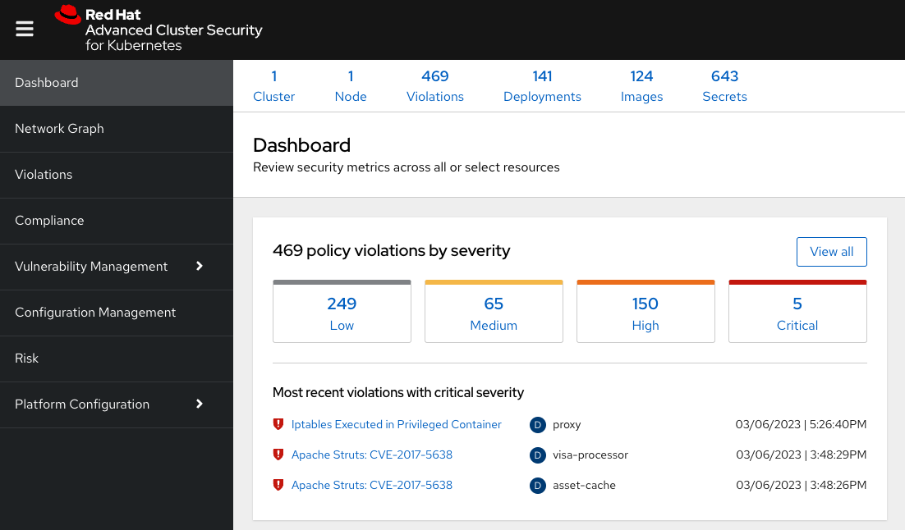

:labname: Course Setup and Product Overview

== {labname} Lab

:numbered:

== Introduction to Course Setup and Product Overview

This course offers you hands-on experience working with the essential use cases of Red Hat^(R)^ Advanced Cluster Security for Kubernetes (RHACS) and the spotlight on new features in new releases.

In this lab, you learn about the environment deployed for running RHACS, verify that you can access the various components of RHACS, and review its major components.

.Goals
* Understand, provision, and access the environment
* Understand RHACS architecture
* Understand the RHACS console
* Test practical use cases and features in RHACS

== Lab Components

In this course, you will utilize the following:

* RHACS portal
* OpenShift Container Platform web console
* Command line

To complete all of the lab tasks.

=== Environment Architecture 

This course comprises a single-node OpenShift Container Platform (OCP) cluster, an OpenShift control plane and a worker node in one large virtual machine (VM). A Linux VM to enable connection to the Lab components is called a Linux^(R)^ student VM. There the lab is comprised of the following components.

1. Red Hat OpenShift^(R)^ Container Platform 4.9 with RHACS installed on a single virtual machine (VM)
2. A Linux^(R)^ student VM (hostname `bastion`) for command line tasks

=== Red Hat OpenShift^(R)^ Container Platform Components

To illustrate that the installation is running Single Node OpenShift. Here is the output of an example `oc get nodes` command that shows the `master` node is also a `worker` node:

*Sample input*
[source,bash]
----
oc get nodes
----
*Sample output*
[source,bash]
----
NAME                                         STATUS   ROLES           AGE   VERSION
ip-10-0-143-248.us-east-2.compute.internal   Ready    master,worker   92m   v1.22.3+ffbb954
----

[NOTE] 
This command can be run later once the connections are set up.

==== Installed OCP Components (RHACS and more)

The following components are necessary to complete the labs installed in the environment. These components include the Red Hat^(R)^ Advanced Cluster Security for Kubernetes (RHACS) application, Red Hat OpenShift Pipelines, and example code to run Tekton pipelines demonstrating RHACS integration.

*  Red Hat^(R)^ Advanced Cluster Security for Kubernetes
** RHACS Central services
*** Central
*** Scanner
** RHACS Secured cluster services
*** Sensor
*** Collector
*** Admission controller

* Red Hat OpenShift Pipelines Operator 
** Tekton Pipelines 
** Tekton Triggers 
** ClusterTasks based on Tekton Catalog 

=== Linux Student VM

A Linux student VM has been provisioned for you with the necessary command line tools to complete the labs.

.Linux Student VM Components
* `roxctl` RHACS command line tool
* `oc` OpenShift command line tool
* `tkn` Tekton command line tool

== Managing the Lab Environment

=== Provisioning the Lab Environment
It is assumed that the lab environment has been provisioned by you already.

The lab environment is cloud-based, so you can access it online from anywhere. Red Hat has made efforts to provide a lab environment that is sufficiently powered to meet the lab's needs. Feel free to use this environment for your experiments with Red Hat Advanced Cluster Security.

NOTE: The environment automatically shuts down after approximately four hours of runtime, so try to finish this course in one sitting.
If necessary, extend the runtime of your environment through the link:https://demo.redhat.com/[Red Hat Demo Platform^].

Read the email carefully and specifically note the following:

* The URL for the RHACS portal and the necessary credentials
* The URL for the OpenShift Container Platform web console and the necessary credentials
* The hostname for your student VM environment and instructions for connecting to it via SSH

[NOTE]
This information will be available in the services tab at link:https://demo.redhat.com/[demo.redhat.com^]. Or in the lab provisioning email.

=== Restarting the Lab Environment After Shutdown

To conserve resources, the lab environment shuts down automatically after four hours.
This section provides the steps to restart it.

.Procedure
. Go to the link:https://demo.redhat.com/[demo.redhat.com^] using your login credentials.
. Navigate to *Services* on the left side
. Locate your lab environment in the list of your services
. On the right-hand side, under the Actions column, you will find the start button, use it.

After a few minutes, expect to receive an email letting you know that the Hands-On with Red Hat Advanced Cluster Security environment has been started.

[NOTE]
After the lab has been restarted, you can extend the default shutdown time out until the end of the day. Otherwise, the lab will pause after 6 hours have lapsed.

== Access Lab Components
Now that you have provisioned the environment, you must verify that you can access the lab's connections.

=== Access the OpenShift Container Platform Web Console 
First, make sure you can access the OpenShift Container Platform web console.

*Requirements*

* The console administrator credentials are `opentlc-mgr`.
* The OpenShift console URL

[NOTE]
This information will be available in the services tab at link:https://demo.redhat.com/[demo.redhat.com^]. Or in the lab provisioning email.

.Procedure

[start=1]
. In the provisioning email (or services tab) you received, click the URL for the OpenShift Container Platform web console.
* The URL for the web console of the cluster
** For example, 'https://console-openshift-console.apps.cluster-4klh8.4klh8.sandbox1150.opentlc.com'

[start=2]
. Log in with the ADMINISTRATOR credentials (opentlc-mgr)

[start=3]
. Ensure you have access to the console and keep your tab open for the future labs 

=== Access the RHACS Console
In this section, you confirm that you can connect to RHACS from the command line and that you can connect to the RHACS portal.

*Requirements* 

* The RHACS `admin` credentials
* The URL for the RHACS portal

[NOTE]
This information will be available in the services tab at link:https://demo.redhat.com/[demo.redhat.com^]. Or in the lab provisioning email.

.Procedure
[start=1]
. Click the URL for the RHACS web console to head to the console's login page.
** For example, 'https://central-stackrox.apps.cluster-4klh8.4klh8.sandbox1150.opentlc.com'

image::images/00-console-dashboard-3.png[RHACS console login]

[start=2]
. Log in with the ADMINISTRATOR credentials (admin)

image::images/00-console-dashboard-4.png[RHACS input]

[start=3]
. Ensure you maintain access to the console and keep your tab open for the future lab sections. 

=== Access the Student VM via SSH

The student VM host serves as an important access point into the environment, so you must ensure you can connect to it.

*Requirements* 

* *The ssh address for the bastion host:* 
** For example, 'lab-user@bastion.4klh8.sandbox1150.opentlc.com' 
* *The username and password for the Linux student VM (lab-user)*

[NOTE]
This information will be available in the services tab at link:https://demo.redhat.com/[demo.redhat.com^]. Or in the lab provisioning email.

.Procedure

.1. Connect to your student VM host using the command and password you received in the provisioning email:

*Sample command*
[source,bash]
----
ssh lab-user@bastion.<$GUID>.<$BASEDOMAIN>
----
*Sample output*
[source,bash]
----
The authenticity of host' bastion.4klh8.sandbox1150.opentlc.com (3.134.153.6)' cant be established.
ED25519 key fingerprint is SHA256:g0H5C1vP1xNqhL7fp0HxMRDPgjgzuAdi3ZIyKQl1mPU.
This key is not known by any other names.
Are you sure you want to continue connecting (yes/no/[fingerprint])? yes
----
.2. Verify that the GUID variable is set correctly for your environment:

*Sample command*
[source,bash]
----
echo $GUID
----
*Sample output*
[source,bash]
----
c3po
----

[NOTE]
Your GUID may be a 4- or 5-character alphanumeric string.

=== Access the OpenShift Cluster in the Student VM via the 'oc' Command

We must first connect to the *Linux Student VM* environment to connect to the OpenShift cluster. In the provisioning email (or service tab)you received, note the following:
 
*Requirements* 

* *The OpenShift credentials for the ADMINISTRATOR OpenShift users:* 
** `opentlc-mgr`, Which is the privileged user and comes with a unique password 
* *The URL for the API of the cluster*
** For example, 'https://api.cluster-4klh8.4klh8.sandbox1150.opentlc.com:6443'

[NOTE]
This information will be available in the services tab at link:https://demo.redhat.com/[demo.redhat.com^]. Or in the lab provisioning email.

.Procedure
[start=1]
. Use the `oc login` command to log in to the cluster as the `opentlc-mgr` user:

*Sample input*
[source,bash]
----
oc login -u opentlc-mgr -p <password from email> <OpenShift API URL from email>
----
*Sample output*
[source,bash]
----
Login successful.

You have access to 76 projects, the list has been suppressed. You can list all projects with 'oc projects'

Using project "default".
----

=== Access the RHACS Central Services in the Student VM via the 'roxctl' Command

In this section, you use the `roxctl` command line tool to send commands to the RHACS server.

* In the provisioning email you received, note the following:
** The URL for the RHACS portal

[NOTE]
This information will be available in the services tab at link:https://demo.redhat.com/[demo.redhat.com^]. Or in the lab provisioning email.

.Procedure
. From the student VM, use the following command to verify your connection to RHACS Central:
*Sample input*
[source,bash]
----
roxctl --insecure-skip-tls-verify -e "$ROX_CENTRAL_ADDRESS:443" central whoami
----
*Sample output*
[source,bash]
----
User:
  auth-token:03b73fd3-313e-40a0-91f5-6ac88d8517a4
Roles:
 Admin, Analyst, Continuous Integration, None, Scope Manager, Sensor Creator, Vulnerability Management Approver, Vulnerability Management Requester, Vulnerability Report Creator
Access:
  rw APIToken
  rw Alert
  rw AllComments
  rw AuthPlugin
  rw AuthProvider
[... further access authorizations omitted for brevity ..]
----

=== Review Lab Access

You should now have access to the following
* Access to the OpenShift Web Console
* Access to the RHACS Web Console
* Access to the Linux Student VM that contains command line access to both
** OpenShift Cluster via 'oc' command
** RHACS Central services via 'roxctl' command

Congrats! Please review the RHACS architecture before moving to the next lab.

== Review RHACS Architecture

For all updated information regarding the RHACS product documentation and architecture. Please refer to the publically available documentation.

*link:https://docs.openshift.com/acs/architecture/acs-architecture.html[RHACS Architecture]*

---

The RHACS Security Platform installs as a set of pods in your OpenShift cluster and includes the following components:

* link:https://docs.openshift.com/acs/3.73/architecture/acs-architecture.html#centralized-components_acs-architecture[**Central**^]: [Centralized component] Central is the main component of RHACS and it is installed as a Kubernetes deployment.
It handles data persistence, API interactions, and user interface (portal) access.
You can use the same Central instance to secure multiple OpenShift Container Platform or Kubernetes clusters.

* link:https://docs.openshift.com/acs/3.73/architecture/acs-architecture.html#centralized-components_acs-architecture[**Scanner**^]: [Centralized component] RHACS includes an image vulnerability scanning component called Scanner.
It analyzes the image layers to check for known vulnerabilities from the Common Vulnerabilities and Exposures (CVEs) list.
Scanner also identifies vulnerabilities in packages installed by package managers and in dependencies for multiple programming languages.

* link:https://docs.openshift.com/acs/3.73/architecture/acs-architecture.html#per-cluster-components_acs-architecture[**Sensor**^]: [1 per cluster] RHACS uses the Sensor component to monitor Kubernetes and OpenShift Container Platform clusters.
It handles interactions with the OpenShift Container Platform or Kubernetes API server for policy detection and enforcement, and it coordinates with Collector.

* link:https://docs.openshift.com/acs/3.73/architecture/acs-architecture.html#per-cluster-components_acs-architecture[**Admission controller**^]: [1 per cluster] The admission controller prevents users from creating workloads that violate security policies in RHACS.
[1 x Admission Controller]

* link:https://docs.openshift.com/acs/3.73/architecture/acs-architecture.html#per-node-components_acs-architecture[**Collector**^]: [1 per node] Collector collects and monitors information about container runtime and network activity.
It then sends the collected information to Sensor.

*Once you are finished, please move on to the next lab activity*
