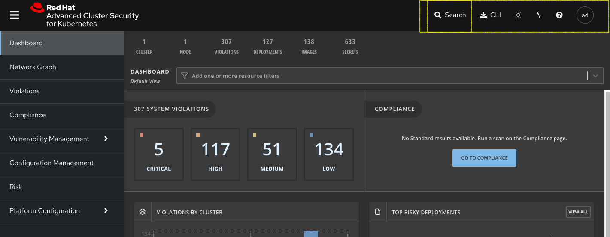

:labname: Course Setup and Product Overview

== {labname} Lab

:numbered:

== Introduction to Course Setup and Product Overview

This course offers you hands-on experience in working with both the essential use cases of Red Hat^(R)^ Advanced Cluster Security for Kubernetes (RHACS), as well as the spotlighted new features included in this release.

In this lab, you learn about the environment deployed for running RHACS, verify that you can access the various components of RHACS, and review its major components.

.Goals
* Understand, provision, and access the environment
* Understand RHACS architecture
* Understand RHACS portal

=== Lab Environment

.Environment Inventory
* Red Hat OpenShift^(R)^ Container Platform 4.9 with RHACS installed on a single virtual machine (VM)
* A Linux^(R)^ student VM (hostname `bastion`) for command line tasks

=== OpenShift Components

For this course, you deploy a single node OpenShift Container Platform cluster, which is an OpenShift control plane and worker node all in one large virtual machine (VM).

Here is the output of an example `oc get nodes` command that shows the `master` node is also a `worker` node:

.Sample Output
----
NAME                                         STATUS   ROLES           AGE   VERSION
ip-10-0-143-248.us-east-2.compute.internal   Ready    master,worker   92m   v1.22.3+ffbb954
----

The components necessary to complete the labs are already installed in the environment.
This includes RHACS, Red Hat OpenShift Pipelines, and example code to run Tekton pipelines demonstrating RHACS integration.

.OpenShift Environment Components
* Red Hat Advanced Cluster Security
** Central
** Scanner
** Sensor
** Admission controller
** Collector
* Red Hat OpenShift Pipelines Operator v1.6.2
** Tekton Pipelines: v0.28.3
** Tekton Triggers: v0.16.1
** ClusterTasks based on Tekton Catalog 0.28

=== Student VM

In the labs for this course, you use the RHACS portal, the OpenShift Container Platform web console, and the command line.
A Linux student VM has been provisioned for you with the necessary command line tools to accomplish the labs.

.Student VM Components
* `roxctl` RHACS command line tool
* `oc` OpenShift command line tool
* `tkn` Tekton command line tool

== Provision Lab Environment

It is assumed that the lab environment has been provisioned by you already.
The lab environment is a cloud-based environment, so that you can access it over the Internet from anywhere.
Red Hat has made efforts to provide a lab environment that is sufficiently powered to meet the lab's needs.
Feel free to use this environment for your own experiments with Red Hat Advanced Cluster Security.

NOTE: The environment automatically shuts down after approximately four hours of runtime, so try to finish this course in one sitting.
If necessary you may extend the runtime of this environment through the link:https://demo.redhat.com/[Red Hat Demo Platform^].

Read the email carefully and specifically note the following:

* The URL for the RHACS portal and the necessary credentials
* The URL for the OpenShift Container Platform web console and the necessary credentials
* The hostname for your student VM environment and instructions for connecting to it via SSH

== Start Environment After Shutdown

To conserve resources, the lab environment shuts down automatically after four hours.
This section provides the steps to restart it.

.Procedure
. Go to the Red Hat Demo portal and use your OPENTLC credentials to log in.
. Navigate to *Services* on the left side
. Locate your lab environment in the list of your services
. On the right hand side under the Actions column you will find the start button, use it.

After a few minutes, expect to receive an email letting you know that the Hands-On with Red Hat Advanced Cluster Security environment has been started.

== Test Access to OpenShift Container Platform
Now that you have provisioned the environment, you need to verify that you can access the lab’s connections.

=== Test Web Console Connections
First make sure you can access the OpenShift Container Platform web console.

.Procedure
. In the provisioning email you received, click the URL for the OpenShift Container Platform web console.
. Log in with the credentials provided in the email.

=== Test Student VM to OpenShift Server Connections

The student VM host serves as an important access point into the environment, so you need to make sure you can connect to it.

.Procedure
. Connect to your student VM host using the command and password you received in the provisioning email:
+
.Sample Command
[source,bash]
----
ssh lab-user@bastion.<$GUID>.<$BASEDOMAIN>
----
+
. Verify that the GUID variable is set correctly for your environment:
+
[source,bash]
----
echo $GUID
----
+
.Sample Output
----
c3po
----
+
[NOTE]
Your GUID may be a 4- or 5-character alphanumeric string.

=== Connect to OpenShift Container Platform Cluster
You can log in to OpenShift once you are connected to your Hands-On environment.

* Your Linux User ID is `lab-user`.
* In the provisioning email you received, note the following:
** The OpenShift credentials for two OpenShift users: `opentlc-mgr` user and `user1` unprivileged user.
** The URL for the API of the cluster--for example, {ocp_api}
** The URL for the web console of the cluster--for example, {ocp_console}

.Procedure
. Use the `oc login` command to log in to the cluster as the `opentlc-mgr` user:
+
[source,bash]
----
oc login -u opentlc-mgr -p <password from email> <OpenShift API URL from email>
----
+
.Sample Output
----
Login successful.

You don't have any projects. You can try to create a new project, by running

    oc new-project <projectname>
----

== Test Connection to RHACS
In this section, you confirm that you can connect to RHACS from the command line and that you can connect to the RHACS portal.

* Your RHACS username is `admin`.
* In the provisioning email you received, note the following:
** The RHACS `admin` user credentials
** The URL for the RHACS portal
** The URL for the RHACS API

=== Test RHACS Portal Connection

.Procedure
. In the provisioning email you received, click the URL for the RHACS portal.
. Log in with the credentials provided in the email.

=== Test Student VM to RHACS Server Connections

In this section, you use the `roxctl` command line tool to send commands to the RHACS server.

.Procedure
. From the student VM, use the following command to verify your connection to RHACS Central:
+
[source,bash]
----
roxctl --insecure-skip-tls-verify -e "$ROX_CENTRAL_ADDRESS:443" central whoami
----
+
.Sample Output
----
User:
  auth-token:03b73fd3-313e-40a0-91f5-6ac88d8517a4
Roles:
 Admin, Analyst, Continuous Integration, None, Scope Manager, Sensor Creator, Vulnerability Management Approver, Vulnerability Management Requester, Vulnerability Report Creator
Access:
  rw APIToken
  rw Alert
  rw AllComments
  rw AuthPlugin
  rw AuthProvider
[... further access authorizations omitted for brevity ..]
----

== Review RHACS Architecture

The RHACS Security Platform installs as a set of pods in your OpenShift cluster and includes the following components:

image::images/architecture_acs.png[ACS Architecture, 800]

* link:https://docs.openshift.com/acs/3.73/architecture/acs-architecture.html#centralized-components_acs-architecture[**Central**^]: [Centralized component] Central is the main component of RHACS and it is installed as a Kubernetes deployment.
It handles data persistence, API interactions, and user interface (portal) access.
You can use the same Central instance to secure multiple OpenShift Container Platform or Kubernetes clusters.

* link:https://docs.openshift.com/acs/3.73/architecture/acs-architecture.html#centralized-components_acs-architecture[**Scanner**^]: [Centralized component] RHACS includes an image vulnerability scanning component called Scanner.
It analyzes the image layers to check for known vulnerabilities from the Common Vulnerabilities and Exposures (CVEs) list.
Scanner also identifies vulnerabilities in packages installed by package managers and in dependencies for multiple programming languages.

* link:https://docs.openshift.com/acs/3.73/architecture/acs-architecture.html#per-cluster-components_acs-architecture[**Sensor**^]: [1 per cluster] RHACS uses the Sensor component to monitor Kubernetes and OpenShift Container Platform clusters.
It handles interactions with the OpenShift Container Platform or Kubernetes API server for policy detection and enforcement, and it coordinates with Collector.

* link:https://docs.openshift.com/acs/3.73/architecture/acs-architecture.html#per-cluster-components_acs-architecture[**Admission controller**^]: [1 per cluster] The admission controller prevents users from creating workloads that violate security policies in RHACS.
[1 x Admission Controller]

* link:https://docs.openshift.com/acs/3.73/architecture/acs-architecture.html#per-node-components_acs-architecture[**Collector**^]: [1 per node] Collector collects and monitors information about container runtime and network activity.
It then sends the collected information to Sensor.

NOTE: Scanner only scans those images that are not already scanned by other integrated vulnerability scanners.
If you have integrated RHACS with other vulnerability scanners, Scanner checks and uses the scanning results from the integrated scanner if available.

== Review RHACS Portal
In this section, you familiarize yourself with the RHACS portal.

.Procedure
. Log in to the RHACS portal from your web browser to see the RHACS dashboard:
+

+
The RHACS portal has four main sections:

* Dashboard
* Top Bar
* Global search
* Navigation menu

.Dashboard

The dashboard serves as the security overview page.
It helps the security team understand what the sources of risk are, categories of violations, and gaps in compliance.
You can click the elements to view more information and the categories are customizable.
It indicates the general state of the OpenShift clusters under management by RHACS, and provides insight into the usage of images and secrets.

.Top Bar

The top bar provides links to Search, Command-line tools, Cluster Health, Documentation, API Reference, and the logged-in user account.

.Global Search

On every page throughout the UI, the Search icon on the top bar allows you to search for any data that RHACS tracks.
It is the place to get answers to questions like, "Are we using this image anywhere?", "Are we impacted by CVE-2020-1008?", and "Who is running user-interactive shell commands in a production container?"

.Navigation Menu

The left-hand navigation menu provides access to each of the security use cases, as well as product configuration to integrate RHACS with your existing tooling.
The navigation menu has the following items:

* *Dashboard*: Summary view of your environment
* *Network Graph*: Configured and actual network flows and the creation of Network Policies to implement network segmentation
* *Violations*: Events that do not match the defined security policies
* *Compliance*: Several industry and regulatory security standards such as PCI DSS
* *Vulnerability Management*: Information about known vulnerabilities affecting your environment, including deployed workloads and infrastructure
* *Configuration Management*: Identification of potential misconfigurations that can lead to security issues
* *Risk*: Risks affecting your environment such as suspicious executions
* *Platform Configuration*: RHACS configuration and integration

This course follows the pattern of the major use cases, but in the order of most common to least common, starting with Vulnerability Management.

== Summary

Congratulations.
You not only deployed your environment, but you connected to the RHACS portal website and the `roxctl` command line tool.

In this lab, you also did the following:

* Reviewed, provisioned, and accessed the environment
* Reviewed RHACS architecture
* Reviewed the RHACS portal

Your Hands-On with Red Hat Advanced Cluster Security lab environment is ready to use.

Please continue to the Vulnerability Management lab.
