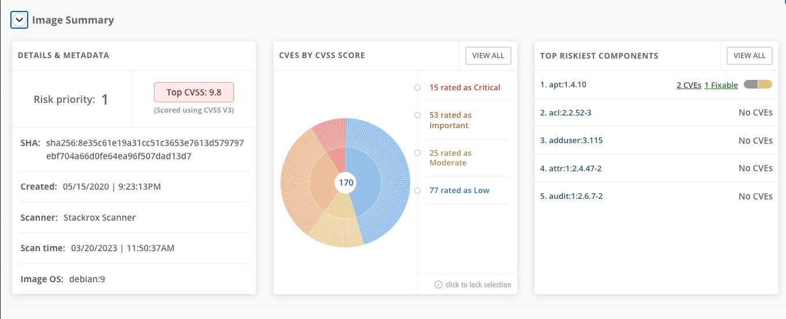
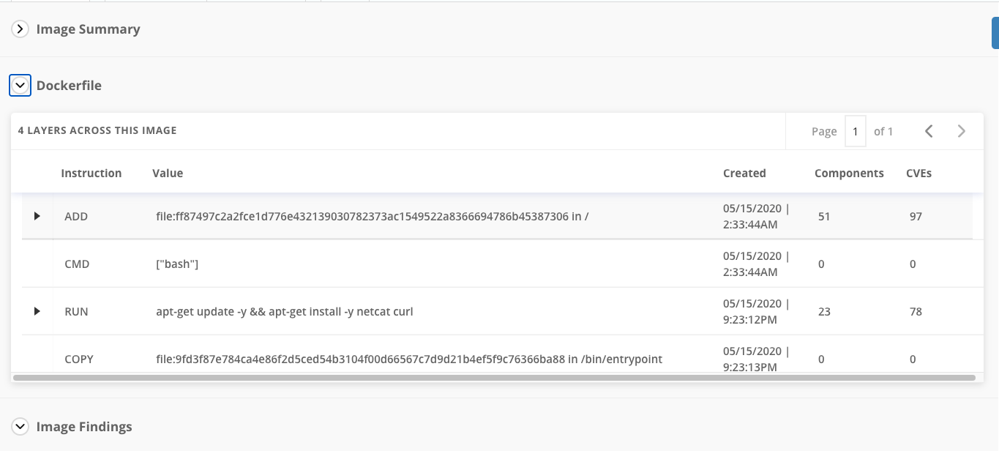
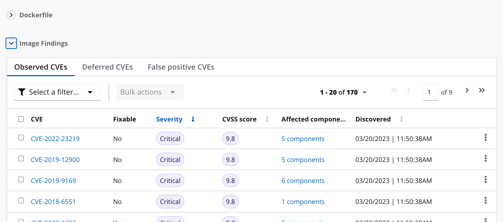
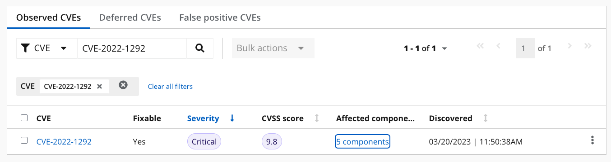
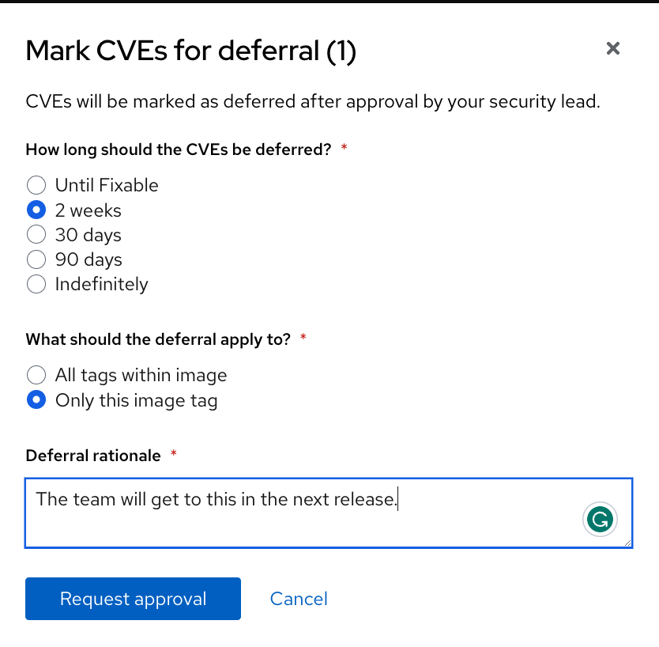
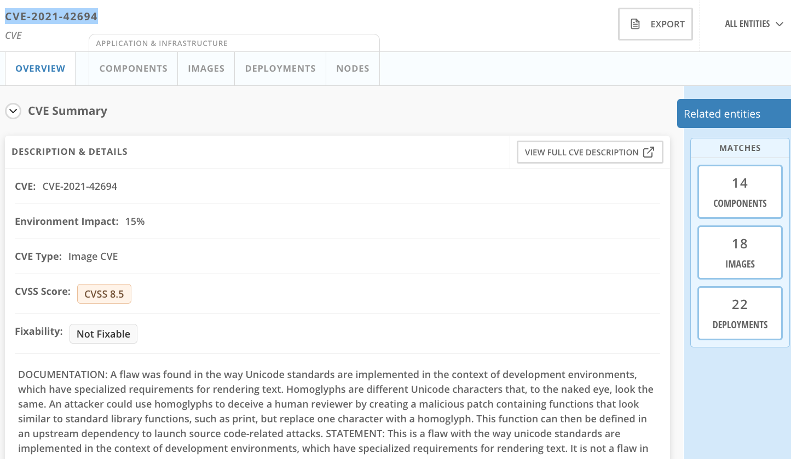
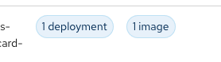
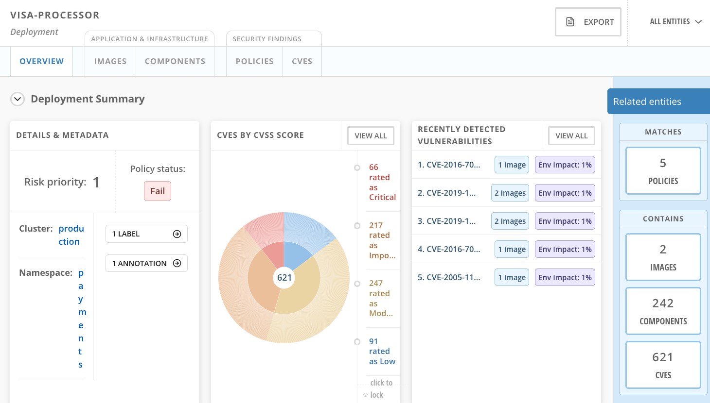
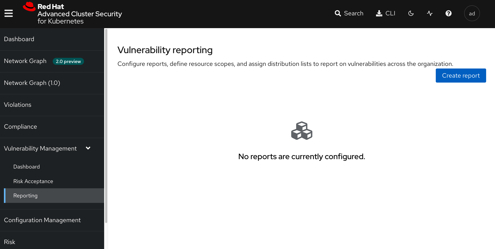

:labname: Vulnerability Management

== {labname} Lab

:numbered:

== Introduction to Vulnerability Management

You start with the topic of vulnerability management because it is familiar to most security teams, even those without prior experience with containers or Kubernetes.

The vulnerability management process helps protect the software supply chain and prevent known vulnerabilities from being used as an entry point into your applications.

In this lab, you explore the vulnerability management features of Red Hat^(R)^ Advanced Cluster Security.

You detect vulnerabilities early in the software lifecycle and work to resolve them.

.Goals

* Understand reports in the Vulnerability Management Dashboard
* Set and manage risk acceptance workflows 
* Create a simple report to email to stakeholders

[[labexercises]]
:numbered:

== Review Vulnerability Management Dashboard

More critical than fixing any vulnerability is establishing a process to keep container images updated and prevent images with serious, fixable vulnerabilities from being promoted through the pipeline.

=== Explore Vulnerability Management Dashboard Reports

The dashboard provides several important reports--where the vulnerabilities are, which are the most widespread or most recent, where your container images are coming from, and essential vulnerabilities in OpenShift^(R)^ itself.

From the RHACS portal, navigate to *Vulnerability Management -> Dashboard* to see the Vulnerability Management Dashboard:

[cols="1a",grid=none,width=100%]
|===
^| image::images/02_vuln_dashboard.png[link=images/02_vuln_dashboard.png,window=_blank]
^| Figure 2.1 - Vulnerability Management Dashboard
^| [small]#Click on image to view large size#
|===

Buttons along the top of the interface will list details by;

- policy violations
- cve
- node vulnerabilities
- image vulnerabilities and risk

The *Application & Infrastructure* button displays a list that takes you to reports by;

- cluster
- namespace
- deployment
- component

Also, note the *Filter CVES* buttons that limit the reports to only *fixable* CVEs or *ALL* CVEs.

[NOTE]
CVE stands for Common Vulnerabilities and Exposures and is managed by the link:https://www.cve.org/[CVE Program website^].

=== Explore Risky Images Report and Image Details

Images are listed here in order of risk, based on the number and severity of the vulnerabilities present in the components in the images.

. Procedure
. Locate the *Top Riskiest Images* panel and hover over some of the images to get quick pop-up windows with the details.
. Locate one of the riskiest images, `visa-processor:sidecar-latest-v2`, and click it.
+
[cols="1a",grid=none,width=100%]
|===
^| image::images/02_vuln_risky_images.png[link=images/02_vuln_risky_images.png,window=_blank]
^| Figure 2.2.1 - Riskiest Images
^| [small]#Click on  image to view large size#
|===

NOTE: If `visa-processor:sidecar-latest-v2` is not in the list of riskiest images, click *View All* and in the *Add one or more filters* box, type `image:` and press *Enter*.
Begin typing the image name, `visa-processor:sidecar-latest-v2`, and let the UI complete the image name for you.
Click the name of the image to select it, then click the name of the image again.

[start=3]
. Review the *Image Overview* tab 
+
The *Image Overview* page will summarize the image, break down its Dockerfile into its components, and summarize all of the CVEs associated with the packages in the container.
+
This is all thanks to the vulnerability scanner built into RHACS breaks down images into layers and components--where components can be operating-system installed packages or dependencies installed by programming languages like Python, Javascript, or Java(TM).
+

[cols="1a",grid=none,width=100%]
|===
^| image::images/03_vuln_image_findings.png[link=images/03_vuln_image_findings.png,window=_blank]
^| Figure 2.2.2 - Container image findings
^| [small]#Click on image to view large size#
|===

[NOTE]
A core aspect of a healthy deployment is that the underlying OS has been updated recently. Whenever an OS is considered "Stale," this will be flagged by RHACS as it becomes more insecure the longer the workload is not updated.

[start=4]
. Review the *Image Summary* tab.
+
The *Image Summary* section provides the critical security details of the image overall, with links to the components.

Close the *Image Summary* tab.

[start=5]
. Review the *Dockerfile* tab

+
Just below the *Image Summary* section, click the *Dockerfile* tab to reveal details of the image's Dockerfile.
+
You can also see, at the top, the warning that CVE data is stale.
This image has a base OS version whose distribution has stopped providing security information and is likely to have stopped publishing security fixes.
+
The *Dockerfile* tab displays the layer-by-layer view, starting from the base image.
+

+
This image shows you a severe security problem--the base image was imported more than four years ago, and even the most recent layers are more than three years old. Time is not kind to images and components. As vulnerabilities are discovered, RHACS displays newly discovered CVEs.

Close the *Dockerfile* tab.

[start=6]
. Review the "Image Findings" tab
+
At the bottom of the *Overview* tab is the *Image Findings* section. It focuses on vulnerabilities, sorted by score and organized into groups of *Observed CVEs*, *Deferred CVEs*, and *False Positive CVEs*. We will use this tab to manage vulnerabilities in the next section.

== Accepting risk

[NOTE]
The Common Vulnerability Scoring System (CVSS) is an open framework for communicating the characteristics and severity of software vulnerabilities.
Find out more at the link:https://nvd.nist.gov/vuln-metrics/cvss[NIST website^].

The CVE list for each image focuses on the _severe_ violations (CVSS >= 7) and the _fixable_ violations where the upstream package maintainers have published a fix.

In this part of the scenario, you have the role of a developer committing to fix a CVE later, or who has investigated the matter and assures the security analyst that this is a false positive.
It is not practical to ask your teams to fix Linux^(R)^ or Javascript, but asking them to pick up fixes published by those communities is reasonable.
You accept the risk by acknowledging the vulnerability and deferring resolution to a later time.
You communicate this to the security team by creating a deferral and requesting approval.
In later steps, you act as the deferral approver and address this.

. Procedure
. Click the *Image Findings* tab.
. Locate a fixable CVE in the list, `CVE-2022-1292`
+ 
You can use the search feature to narrow the list.

NOTE: 
This CVE example is severe--scoring 9.8/10--but fixable.
It is a vulnerability in OpenSSL, and these packages are present because they are either part of a base image or were deliberately added by a developer in one of the Dockerfile layers.

[start=3]
. Close the *Affected Components* window.
. Click the options menu icon

In the right column and select *Defer CVE* to open the *Mark CVEs for deferral* dialog box.

[start=5]
. Select *2 Weeks* and *Only this image tag*, enter a *Deferral rationale* of your choosing, and click *Request Approval*.
+
The CVE updates with a blue information icon next to the CVE name.

. Click the blue information icon to the right of the CVE and copy the approval link to share with your organization's deferral approver.
. Close the *Vulnerabilities Defer* windows by clicking *X* on the right.

Now move on to look at deployments of this vulnerability.

== Exploring Widespread Vulnerabilities and How to Triage Accordingly

All of this CVE detail is well and good, but it is a bit noisy.
How do you judge the true risk--which vulnerabilities are likely to be exploited? In other words, which vulnerabilities do you have to fix first?

RHACS can use other sources of information in the OpenShift Container Platform to judge the risk of a given vulnerability being exploited and set priorities for fixes.
The first risk factor you can check is whether the vulnerable component is in a running deployment.

. Procedure
. Scroll back to the top of the *Vulnerability Management Dashboard* and locate the *MOST COMMON VULNERABILITIES* panel.

. Click the `CVE-2021-42694` component to open a new panel with details about this vulnerability. This page will give an overview of where the vulnerability is and how big of an impact it has in the cluster. Click on the 'Deployment' tab at the top.

[start=3]
. Click *22 deployments* in the *Related Entities* column on the right to be taken to a list of active deployments that include this vulnerable component.
+
These deployments are running right now with different containers that come from images with this vulnerability present.

*Up and running* is a risk factor. Vulnerabilities are typically exploited in a running container somewhere in the cluster. RHACS displays the critical information here so that this image is present in the production cluster, in namespaces like payments, which provides context to the security team. The last column on the right displays the risk priority, which RHACS has already determined from configuration and runtime activity in the deployment.

While this vulnerability is present, it is not currently fixable. If the fix comes out in the future, we will address it. For now, we can only shore up our configuration and defer the CVE to later. 

=== Manage Risk Acceptance

As a security analyst who is a deferral approver, you can evaluate requested deferrals and respond to them through the RHACS portal.

. Procedure
. Navigate to *Vulnerability Management -> Risk Acceptance* and search for the from the previous example, CVE-2022-1292.

image::images/02_vuln_10.png[]

[start=2]
. Review the vulnerability's comments, scope, and action to decide if you want to approve it.
. Click  the three dots,

At the far right of the CVE, approve or deny the request for approval and provide a rationale.

You can see your *Approved Deferrals* from the appropriate tab above and make changes.
. You can also click through to the deployment that has that vulnerability and see its *Risk Priority*:

[start=4]
. Next, Click `1 deployment`:

[start=5]
. Click the `visa-processor` link to be taken to the *Deployment Overview*.

How is *Risk Priority* determined?

That is the subject of the next lab, *Risk Management*

== Report Vulnerabilities to Teams

IMPORTANT: You cannot send reports in this training lab. It is not integrated with an email server without an email notifier.

As organizations must constantly reassess and report on their vulnerabilities, some find it helpful to have scheduled communications with key stakeholders to help manage vulnerabilities.

You can use RHACS to schedule these regular communications through email. Red Hat recommends that you scope these communications to the most relevant information that the key stakeholders need.

For sending these communications, you must consider the following questions:

* What schedule would have the most impact when communicating with stakeholders?
* Who is the audience?
* Should you include only specific severity vulnerabilities in your report?
* Should you include only fixable vulnerabilities in your report?

The following procedure creates a scheduled vulnerability report.

. Procedure
. From the RHACS portal, navigate to *Vulnerability Management -> Reporting*.

. Click *Create report*.
. Enter a name for your report in the *Report name* field: `Deferrals in Payments`.
. Select a weekly or monthly cadence for your report under *Repeat report*: `Weekly`.
. Enter a *Description* for the report: `All deferrals in the Payments namespace`.
. On the next line, there is a series of dropdown boxes to select which vulnerabilities to report.
There are options to report fixable vulnerabilities, vulnerabilities of a specific severity, or only vulnerabilities that have appeared since the last scheduled report.
From the *CVE Severties* drow-down menu, select `Critical` and `Important` severities.
. Under *Configure resource scope*, click *Create resource scope* and create one for the namespace `payments`, and under *Allowed resources* use the switch under *Manual selection* to select the `production` cluster.
. Click *Save*, which returns to the *Create a vulnerability report* page.
. Select or create an email notifier to send your report by email and configure your distribution list under *Notification and distribution*.
. Click *Cancel* because this lab environment does not have an available SMTP server to back an email notifier.

== Summary

In this lab, you learned how to interpret the reports in the Vulnerability Management Dashboard.
You went on to set and manage risk acceptance workflows.
Finally, you created a simple report to email to stakeholders.