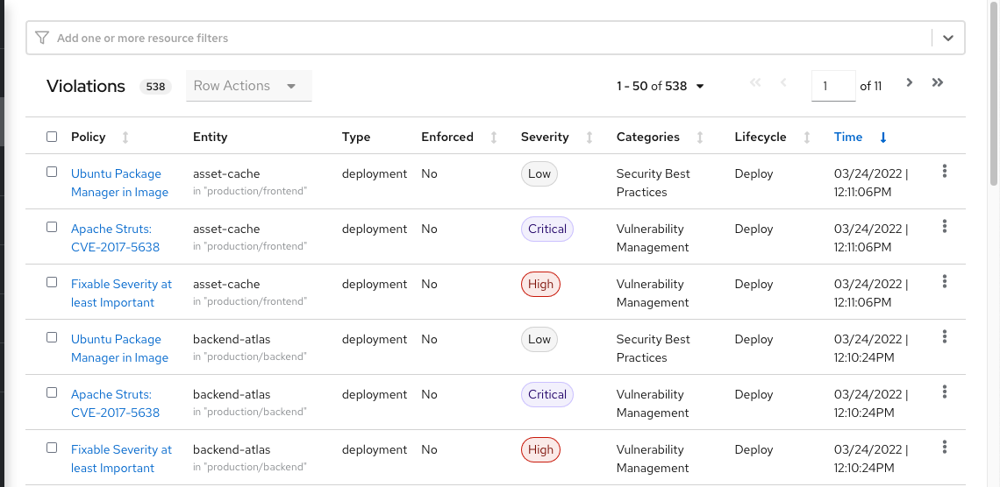
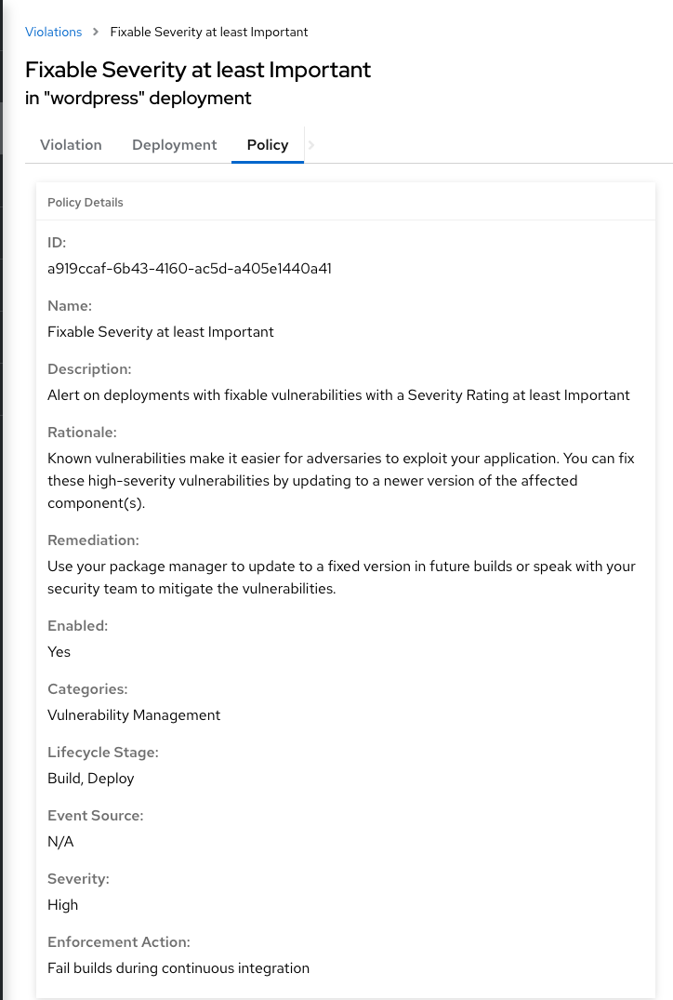
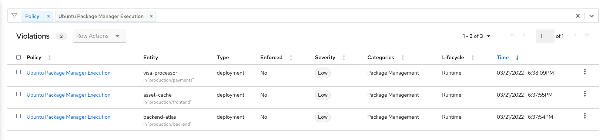
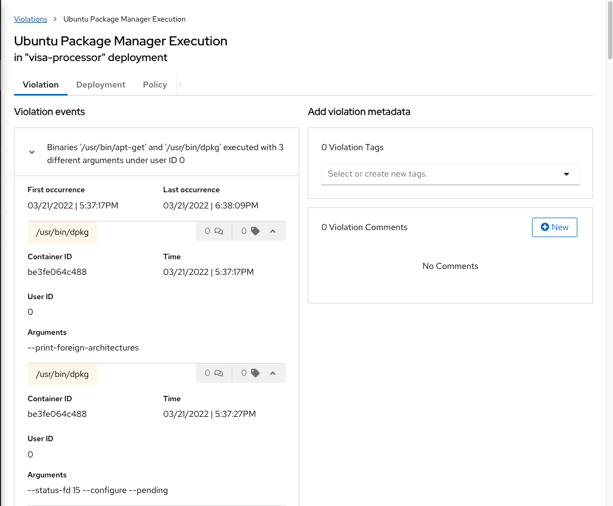
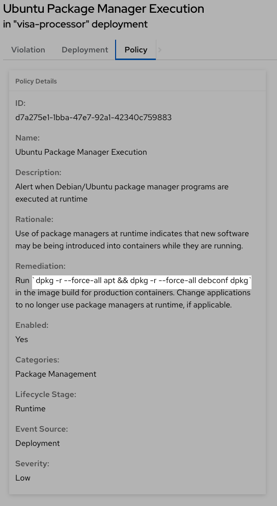

:labname: Violations

== {labname} Lab

:numbered:

== Introduction to {labname}

Violations record the specific times when policy criteria were met by any of the objects in your cluster--images and their components, deployments, and runtime activity.
Think of it as the _stream_ of events that occurred, although you do not want this to be just a _to-do_ list for the incident response team.

In this lab, you become acquainted with how Red Hat^(R)^ Advanced Cluster Security for Kubernetes (RHACS) responds to violations.

.Goals

* Understand build-time and deployment-time violations
* Understand runtime violations
* Use the policy summary to direct remediation

[[labexercises]]

== Understand Violations

Violations taken together determine _risk_, which you covered in previous labs.
In this lab, you explore how to determine the details of those violations to plan and implement their remediation.
The *Violations* view allows you to see these details.

Using RHACS, you can view policy violations, drill down to the actual cause of the violation, and take corrective actions.

The built-in policies identify a variety of security findings, including vulnerabilities (CVEs), violations of DevOps best practices, high-risk build and deployment practices, and suspicious runtime behaviors.
You can use the default out-of-the-box security policies or your own custom policies.

=== Examine Violations Overview

.Procedure
. From the left navigation menu, select the *Violations* tab:
+

=== Examine Build and Deployment Time Violations

Build-time and deployment-time events occur only once--when the build or deployment is created in the system.
This is distinct from runtime events, which occur during the lifetime of the containers.
In this section, you examine what these violation events look like, and the policy that they violated.

.Procedure
. In the filter bar, find the `Policy: Fixable Severity at least Important`.
+
Expect to see a list of violation events.
They are the events captured during build and deploy time.
+
. From the list, click one of the violation events.
. Click the *Policy* tab:
+
// image::rhacs_violations_deployment_events.png[RHACS Violations - Deploy Time]

+
The *Policy Details* page includes a detailed description, rationale, and remediation for the violation.
Note that *Lifecycle Stage* is set to `Build, Deploy`.
This is the same information presented in a CI/CD tool or developer console when using build-time integration.

=== Examine Runtime Violations

Runtime violations have a different set of details and actions available.
The forensic data recorded is familiar to most incident response teams--the _who, what, when, where, and why_ of the activity--including for example, process names, arguments, UIDs, and container IDs.
In this case, for your lab, there is no enforcement of the action, just a notification, and the team has options to resolve or suppress these notifications in the future.

.Procedure
. From the left navigation menu, select the *Violations* tab.
. Create a `Policy: Ubuntu Package Manager Execution` filter to find an example runtime policy:
+

+
. Under *Entity*, select the violation with the `visa-processor in "production/payments"`, and expect the *Violation Detail* page to appear.
. Examine the _runtime_ *Violation events* to see that they look considerably different from the _deploy-time_ events.
The _who, what, when, where, and why_ are all present:
+

=== Use Policy Summary

RHACS has a number of built-in policies to detect activity related to attacker goals--gain a foothold, maintain a presence, move laterally, and exfiltrate data.
The continuous runtime monitoring observes the container activity and automatically responds to events with appropriate enforcement and notification.

But that may be missing out on an opportunity, and RHACS goes one step further to take advantage of the ephemeral, immutable nature of containers to improve security in a measurable way moving forward.
In this case, package managers, which are useful in a virtual machine context, serve no valid purpose in a containerized workload.

In this section, you lean how to remove the package manager--using the simple Dockerfile command below--to lower the surface area for attack in the next build, interrupting attack chains that depend on it.

.Procedure
. In the *Violation Details* view, click the *Policy* tab.
. Highlight the text of the Dockerfile in the `Remediation` section of the policy:
+

You are using runtime incidents as learning opportunities to improve security going forward by constraining how your containers can act.

== Summary

In understanding violations, you can see the scope and persistence of a particular policy violation, and communicate the remediation procedures anywhere in the software supply chain--from build, through deployment, to runtime.

In the next lab, you examine and create policies.
