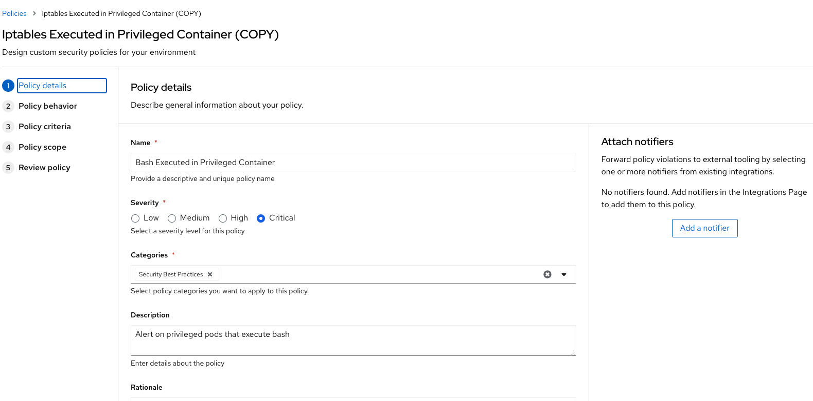
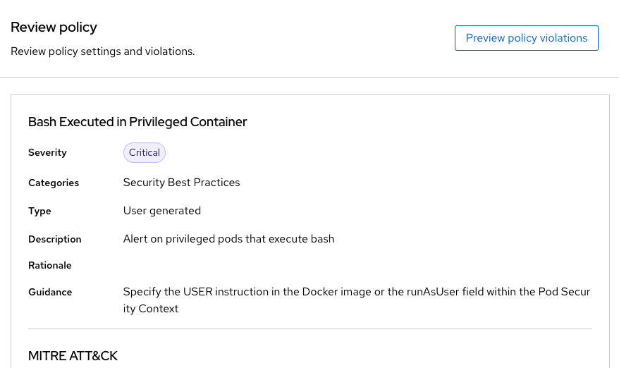

:labname: Policies

== {labname} Lab

:numbered:

== Introduction to {labname}

The heart of Red Hat^(R)^ Advanced Cluster Security for Kubernetes (RHACS) is the policy engine.
This is the highlight of this course.

You can use out-of-the-box security policies and define custom multi-factor policies for your container environment.
Configuring these policies enables you to automatically prevent high-risk service deployments in your environment and respond to runtime security incidents.

=== Power of Single Policy Engine

Policy criteria can cross the build, deploy, and runtime lifecycles.
For example, policies can highlight vulnerabilities in deployments with privileged containers in that deployment.
Another example is runtime criteria, such as the execution of shell commands, in containers in deployments that have external network exposure.
It is fairly easy to write a policy that prevents use of compilers and other build tools (except in development clusters) in namespaces for CI/CD tools.
There are no silos like those in other tools that require you to manage policies for vulnerabilities and runtime separately.
The unified policy engine allows for targeted conditions and targeted enforcement, easily allowing exceptions for specific applications after approval by security.

In this lab, you learn about out-of-the-box system policies, policy enforcement, and policy categories.
You build on what you learned in prior labs to create and exercise policies in the build, deploy, and runtime phases.

.Goals
* Understand system policies
* Understand policy enforcement
* Create and use policy categories

[[labexercises]]

== Understand System Policies
M
The policies that ship with the product are designed with the goal of providing targeted remediation that improves security hardening.
This list contains many build- and deploy-time policies to catch misconfigurations early in the pipeline, but also runtime policies that point back to specific hardening recommendations.
While these policies come from Red Hat's expertise and interpretations of industry best practice and  common compliance standards, you can modify them or create your own.

=== Examine Specific Policy

In this section, you open a *Policy Management* panel to learn more about a policy.

.Procedure
. From the left navigation menu, select the *Platform Configuration* tab and then *System Policies*:
+
image::images/06_policy_01.png[RHACS Policy Overview]

. Select the `Alpine Linux Package Manager (apk) in Image` policy.
. Examine the policy details:
+
image::images/06_policy_02.png[RHACS Policy Specific]

This is what an RHACS policy looks like. The descriptive details under *Policy Details*, *Rationale*, and *Remediation* provide the DevOps team with context about why this issue is important for security and, more importantly, what to do about it.
This policy violation notes that including package managers in containers is a security risk.
While useful in a container context, they represent a tool that an attacker can use to install software and normally do not provide a legitimate use. A best practice is to have containers ship with their required dependencies already installed.

=== Enable Specific Policy Enforcement

RHACS focuses on empowering and encouraging developers to understand and resolve security issues in their own deployments.
Sometimes you have to balance the carrot with a stick, because security officers need to know that dangerous misconfigurations are not to be promoted and deployed in certain environments. That is where policy enforcement comes in.

In the example below we will copy the `Iptables` policy and turn it into a `Bash` policy to inform us when developers might be testing their containers.

.Procedure
. From the list, select the `Severity CRITICAL_SEVERITY` policy.
. locate the option for `Iptables Executed in Privileged Container`
. click the 3 dots on the right of the page and select the option to clone the policy. The goal is to have a policy that looks like the following. Feel free to play around as you do not need to be exact in these steps.

[start=4]
. Click *Next* (right arrow) to see *Policy Criteria*.
. Click *Next* to see *Violations Preview*.
. Click *Next* to see *Enforcement*.
. Make sure the *ON* switch is clicked for runtime enforcement.
. Click *Save* (the floppy disk icon).
. Review the policy 

Enforcement is another demonstration of Kubernetes-native security, leveraging the pipeline process to prevent unacceptable risks.
In the absence of CI/CD integration, or for images that are promoted without going through CI/CD, you leverage the built-in power of a Kubernetes Admission Controller to decide if a deployment can be created.
You are essentially programming OpenShift^(R)^ to reduce security risks.
The security team gets their enforcement, and DevOps sees a _normal_ failure from the OpenShift API, with clear remediation/guidance steps instead of a nebulous error that forces them to open a ticket or look in another console.

== Summary

In this lab, you learned how the single policy engine is used to create flexible policies that can span the entire software lifecycle.
This enables the _Shift Left_ principle of security awareness: to move a task traditionally done later in time to an earlier point in the development cycle--in this case, to the earliest developer builds. While we used a runtime example in this section. Certain policies can be enforced in the build and deploy stages to give developers information as early as possible in the development stage.

In the next lab, you activate these policies to comply with common security standards.
