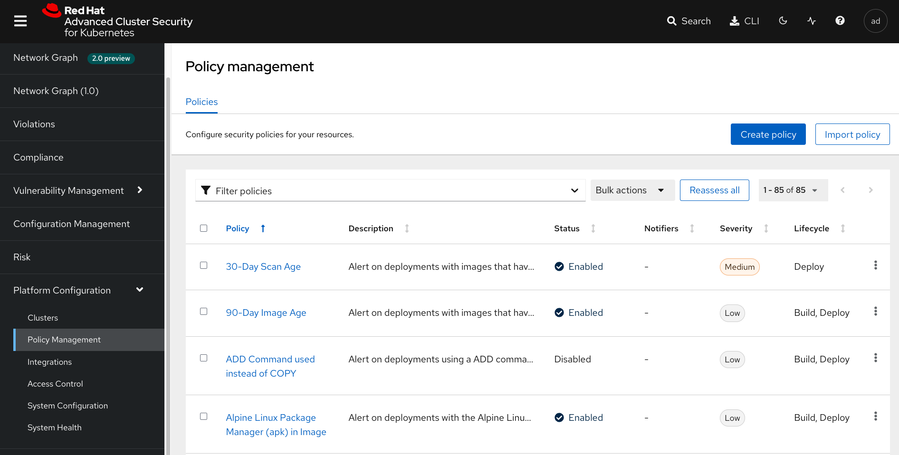
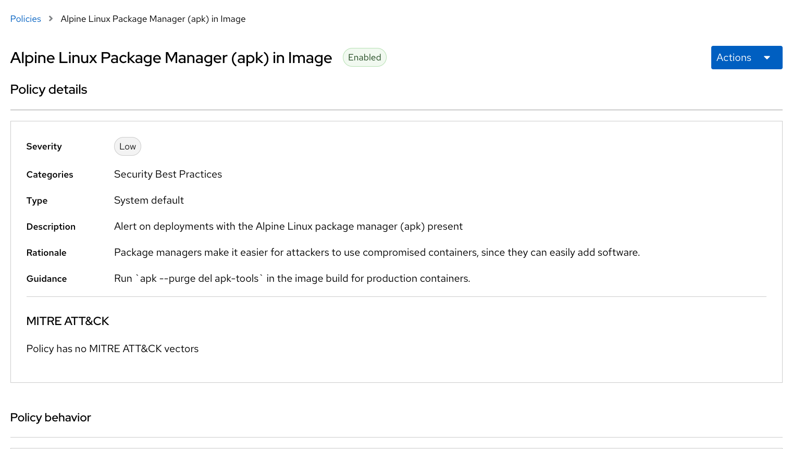

:labname: Policies

== {labname} Lab

:numbered:

== Introduction to {labname}

The heart of Red Hat^(R)^ Advanced Cluster Security for Kubernetes (RHACS) is the policy engine.
This is the highlight of this course.

You can use out-of-the-box security policies and define custom multi-factor policies for your container environment.
Configuring these policies enables you to automatically prevent high-risk service deployments in your environment and respond to runtime security incidents.

=== Power of Single Policy Engine

Policy criteria can cross the build, deploy, and runtime lifecycles.
For example, policies can highlight vulnerabilities in deployments with privileged containers in that deployment.
Another example is runtime criteria, such as the execution of shell commands, in containers in deployments that have external network exposure.
It is fairly easy to write a policy that prevents use of compilers and other build tools (except in development clusters) in namespaces for CI/CD tools.
There are no silos like those in other tools that require you to manage policies for vulnerabilities and runtime separately.
The unified policy engine allows for targeted conditions and targeted enforcement, easily allowing exceptions for specific applications after approval by security.

In this lab, you learn about out-of-the-box system policies, policy enforcement, and policy categories.
You build on what you learned in prior labs to create and exercise policies in the build, deploy, and runtime phases.

.Goals
* Understand system policies
* Understand policy enforcement
* Create and use policy categories

[[labexercises]]

== Understand System Policies
M
The policies that ship with the product are designed with the goal of providing targeted remediation that improves security hardening.
This list contains many build- and deploy-time policies to catch misconfigurations early in the pipeline, but also runtime policies that point back to specific hardening recommendations.
While these policies come from Red Hat's expertise and interpretations of industry best practice and  common compliance standards, you can modify them or create your own.

=== Examine Specific Policy

In this section, you open a *Policy Management* panel to learn more about a policy.

.Procedure
. From the left navigation menu, select the *Platform Configuration* tab and then *System Policies*:
+

. Select the `Alpine Linux Package Manager (apk) in Image` policy.
. On the right, examine the policy details:
+

This is what an RHACS policy looks like. The descriptive details under *Policy Details*, *Rationale*, and *Remediation* provide the DevOps team with context about why this issue is important for security and, more importantly, what to do about it.
This policy violation notes that including package managers in containers is a security risk.
While useful in a container context, they represent a tool that an attacker can use to install software and normally do not provide a legitimate use. A best practice is to have containers ship with their required dependencies already installed.

=== Enable Specific Policy Enforcement

RHACS focuses on empowering and encouraging developers to understand and resolve security issues in their own deployments.
Sometimes you have to balance the carrot with a stick, because security officers need to know that dangerous misconfigurations are not to be promoted and deployed in certain environments. That is where policy enforcement comes in.

.Procedure
. From the list, select the `Severity CRITICAL_SEVERITY` policy.
+
TIP: To easily find the entry, scroll down approximately 20-30 rows or type `fixable` in the filter bar.

. In the upper right of the policy, click *Edit* (the paper and pencil icon).
. Click *Next* (right arrow) to see *Policy Criteria*.
. Click *Next* to see *Violations Preview*.
. Click *Next* to see *Enforcement*.
. Make sure the *ON* switch is clicked for both build-time and deploy-time enforcement.
. Click *Save* (the floppy disk icon).

Enforcement is another demonstration of Kubernetes-native security, leveraging the pipeline process to prevent unacceptable risks.
In the absence of CI/CD integration, or for images that are promoted without going through CI/CD, you leverage the built-in power of a Kubernetes Admission Controller to decide if a deployment can be created.
You are essentially programming OpenShift^(R)^ to reduce security risks.
The security team gets their enforcement, and DevOps sees a _normal_ failure from the OpenShift API, with clear remediation steps instead of a nebulous error that forces them to open a ticket or look in another console.

== Work with Policy Categories

RHACS provides built-in categories for policies, including vulnerability management, DevOps best practices, network tool usage, and system modification.
The front-page *Dashboard* uses *Categories* to chart the number and severity of violations in each.
It is relatively easy to create a custom category for dashboard visibility.

Custom categories can be useful for grouping your specific policies. For example, you can use RHACS to police workflow errors and summarize those violations in a workflow category for easy searching and summarization.

This example shows the use of categories to aid in responding to incidents by adding a category called `Investigation` whose purpose is to mark incidents that possibly require attention by a security team member.

.Procedure
. Navigate to the *System Policies* view to create a new policy or select an existing one.
. Select a policy that already has violations, such as `Latest Tag` by typing `Policy: Latest Tag` into the filter bar.
. Select the `Latest Tag` policy, and then use *Edit* in the panel on the right.
. In the *Categories* field, type `Investigation` and press *Enter* to add the value.
+
. Examine your policy and expect it to look like this:
+
image::images/rhacs_policy_categories_new.png[RHACS Policy Categories]

. Click *Next*, and then *Next* again, and then click *Save*.
. Return to the *Dashboard* and scroll down to find the *INVESTIGATION* graph.
. Because you set the *Severity* to `Low`, you will see a graph of low risk violations.
+
image::images/rhacs_policy_category_graph.png[RHACS Policy Category Graph]
+
NOTE: As long as there are active violations, the new category appears in the dashboard within a few minutes.
As you add the `Investigation` category to other policies, those violations are detailed on the dashboard in this category.

. Click the `Low` link on the graph to display the violations that match this category:
+
image::images/rhacs_policy_category_graph_list.png[RHACS Policy Category Graph List]
+

Also of convenience, the filters in the *Violations* page now populate your custom categories.

. Click on `Violations` on the left navigation bar.
. Use the Filter bar and enter `Category`.
You will see a list of categories.
. Begin typing `Investigation` and you will see it autocomplete, as in the image.
+
image::images/rhacs_policy_categories_filter_investigation.png[RHACS Policy Filter includes Category Investigation]

== Summary

In this lab, you learned how the single policy engine is used to create flexible policies that can span the entire software lifecycle.
This enables the _Shift Left_ principle of security awareness: to move a task traditionally done later in time to an earlier point in the development cycle--in this case, to the earliest developer builds.

You enabled the enforcement of a policy, and created and used policy categories to begin to organize your security reporting and analysis.

In the next lab, you activate these policies to comply with common security standards.
