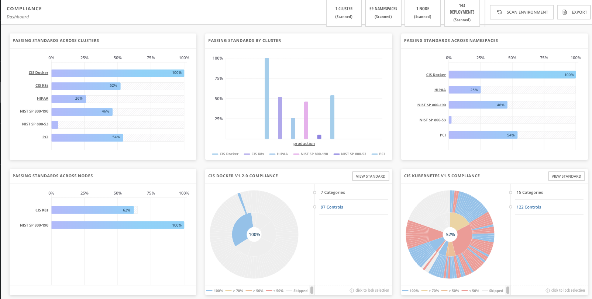
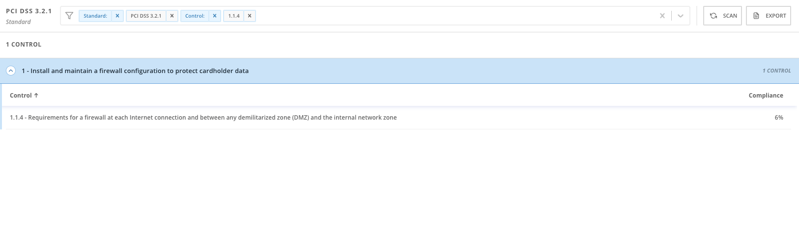
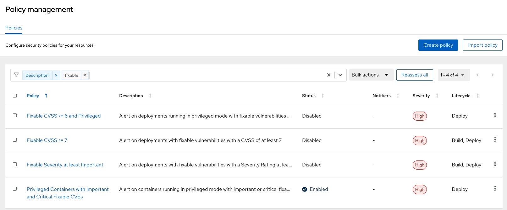
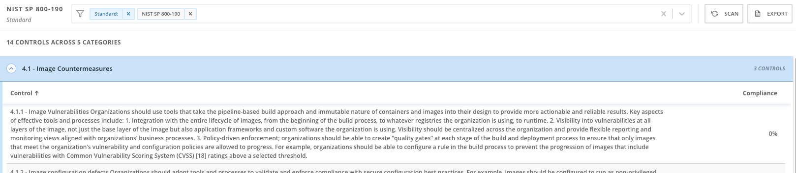
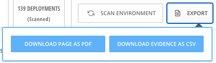

:labname: Compliance

== {labname} Lab

:numbered:

== Introduction to {labname}

The compliance reports of Red Hat^(R)^ Advanced Cluster Security for Kubernetes (RHACS) gather information for configuration, industry standards, and best practices for container-based workloads running in OpenShift^(R)^.
You are already familiar with some compliance features because they are tied to controls you saw in the *Risk* view--on the *Network Graph* and in *Policies* pages.
Each standard represents a series of controls, with guidance provided by Red Hat on the specific OpenShift configuration or DevOps process required to meet that control.

.Goals

* Understand compliance as it relates to policies and standards
* Enable policy enforcement to bring systems into standards compliance
* Export evidence of compliance for analysts and regulators

[[labexercises]]

== Manage Standards Details

=== Explore Compliance

.Procedure
. From the left navigation menu, select the *Compliance* tab:
+

+
. In the upper left of the *Passing Standards Across Clusters* graph, click *PCI* or the *PCI* percentage bar.
. Search for `Control 1.1.4, "Requirements for a firewall..."`.
+
In this example, PCI-DSS has controls that refer to firewalls and the DMZ (not really relevant to cloud-native).
In OpenShift, that requirement and other isolation requirements are met by network policies.
The low (approximately `6%`) compliance score shown in this image indicates that only a small percentage of your deployments have correctly defined policies.
+

+

+
. From the left navigation menu, click the *Compliance* tab.
. Select the `NIST SP 800-190` pie chart.
. Search `Control 4.1.1, "Image vulnerabilities..."`.
+

NOTE:
If the control's compliance is `100%`, the `Fixable Severity at least Important` policy is enabled and set to enforcing.

To see the standard drop to `0%`, do the following activity and to turn the policy enforcement *OFF*.

NOTE: The `NIST 800-190` application containers security standard requires a pipeline-based build approach to mitigating vulnerabilities in images.

[start=7]
. Toggle enforcement of the `Fixable Severity at least Important` policy by finding the policy and editing.
Click *Platform Configuration -> System Policies*from the left navigation menu.

[start=8]
. Type `Fixable Severity` into the filter bar to find the policy, then click the full name `Fixable Severity at least important`, then click away from the filter bar.
. Click to the right of the policy and disable it.

NOTE: If NIST SP 800-190 Control 4.1.1 was already showing 100% compliance, then turn these enforcements off to demonstrate the Control out of compliance at 0%.

[start=10]
. Return to the *Compliance* view and select the `NIST SP 800-190` standard.
. Examine the results and note the value of the `Control 4.1.1` compliance percentage.
. Click *Scan*, and watch as the compliance percentage changes.
+
Because you changed enforcement to the `Fixable Severity at least Important` policy, you now meet the requirement dictated by `Control 4.1.1`, and the `100%` score changes to `0%` because you now have the control in place to prevent known vulnerabilities from being deployed.

WARNING: As of recent releases of RHACS, the `Fixable CVSS >= 7` policy was _deactivated by default_, and replaced with `Fixable Severity at least Important`.
The name `CVSS >= 7` implies a value of `Important`.
Red Hat is now migrating to a method of expressing policy independent of single measures, adopting a more general and actionable language.

=== Examine Namespace Compliance

.Procedure
. On the left navigation menu, click the *Compliance* tab.
. In the top toolbar of the *Compliance* page, click *Namespaces*.
+
Breaking this data down into clusters, namespaces, and deployments is valuable.
Namespaces are particularly useful because they can show where the gaps in compliance are application-by-application or team-by-team.

=== Export Evidence

.Procedure
. On the left navigation menu, click the *Compliance* tab.
+
A final note about compliance--you are only as compliant as you can prove!
+
. In the upper right, click *Export* to show the *Download Evidence as CSV* option:
+

+
This is the evidence export that your auditors may want to see for proof that the mandated security controls are in place.

== Summary

In this lab, you explored how standards compliance is affected by policy enforcement and how to implement policy to impact compliance levels.

You also exported reports of standards compliance.

In the next lab, you complete activities that test policies at build time, deploy time, and runtime.

