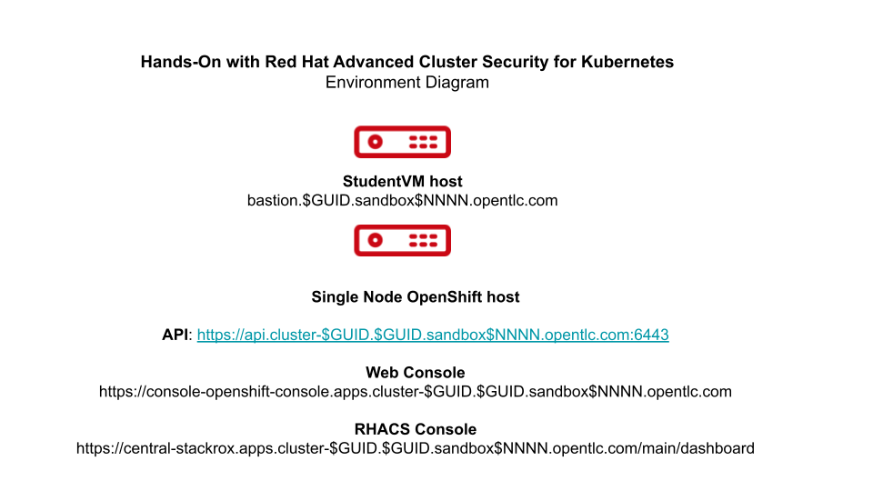

:noaudio:

ifdef::revealjs_slideshow[]

[#cover,data-background-image="image/1156524-bg_redhat.png" data-background-color="#cc0000"]

== &nbsp;

[#cover-h1]
Hands-On with Red Hat Advanced Cluster Security

[#cover-h2]
Introduction

[#cover-logo]
image::{revealjs_cover_image}[]

endif::[]

== Module Topics
:noaudio:

* Course Overview
* Assumptions
* RHACS Theme
* Class Environment Topology
* Summary of Labs

ifdef::showscript[]

Transcript:

endif::showscript[]

== Course Overview

:noaudio:

* The purpose of this course is to learn Red Hat^(R)^ OpenShift^(R)^ Advanced Cluster Security for Kubernetes (RHACS) features.
** You do not need to stay within the course materials.
** Feel free to experiment.
** For credit, complete the assessment in the final module.
* You have:
** `cluster-admin` role authorization on the cluster
** `admin` authorization on the RHACS services
* In the lab environment:
** A Linux^(R)^ `bastion` StudentVM is available for command-line operations.
** Single node OpenShift is available as both a control plane and a worker.
*** RHACS, OpenShift pipelines, and demo applications are installed.

ifdef::showscript[]

Transcript:

endif::showscript[]

== Course Overview
:noaudio:

.Course Topics

* This course consists of hands-on labs with learning activities, references, and resources.
* Topics cover the following RHACS use cases and features:
** Vulnerability management
*** New in v3.68: Risk acceptance workflows, reporting workflows
** Risk profiling
** Network segmentation
** Violations
** Policies
** Compliance
** Build-time, deploy-time, and runtime policies

ifdef::showscript[]

Transcript:

endif::showscript[]

== Assumptions
:noaudio:

* You are comfortable using the OpenShift Container Platform web console.
* You can read, modify, and run OpenShift YAML manifests.
* You are familiar with deploying applications on OpenShift Container Platform.
* You have:
** A workstation available for training
** An up-to-date web browser

ifdef::showscript[]

Transcript:

endif::showscript[]

== RHACS Theme
:noaudio:

* RHACS is designed to take advantage of as many core Kubernetes features as possible.
** For example, RHACS does not implement its own firewall.
** Instead, it creates and reports Kubernetes network policies to fulfill the roles of flow diagram, firewall, and rule builder all in one.

* RHACS has a unified policy engine that creates and manages policies for the three major stages of the software lifecycle: build, deploy, and runtime.
** Policies can apply to some or all of these stages.

ifdef::showscript[]

Transcript:

endif::showscript[]

== Class Environment Topology
:noaudio:

* The environment includes:
** One StudentVM bastion host for command-line access to the cluster
** One single node OpenShift Container Platform cluster where OpenShift Container Platform, RHACS, policies, pipelines, and applications are deployed

ifdef::showscript[]

Transcript:

endif::showscript[]

== Summary of Labs
:noaudio:

.Course Setup and Product Overview Lab

* In this lab, you complete the following:
** Understand, provision, and access the environment.
** Understand the RHACS architecture and portal.

ifdef::showscript[]

Transcript:

endif::showscript[]

== Summary of Labs
:noaudio:

.Vulnerability Management Lab

* Vulnerability management protects the software supply chain and prevents known vulnerabilities from being used as entry points in applications.

* In this lab, you complete the following:
** Understand reports in the vulnerability dashboard.
** Set and manage risk acceptance workflows (new in RHACS 3.68).
** Create a simple report to email to stakeholders (new in RHACS 3.68).

ifdef::showscript[]

Transcript:

endif::showscript[]

== Summary of Labs
:noaudio:

.Risk Lab

* Risk profiling can be used to understand how deployment-time configuration and runtime activity impacts the likelihood of an exploit occurring and how successful those exploits can be.

* In this lab, you complete the following:
** View risk justifications.
** Lock baselines to track deviations.
** Quickly find vulnerabilities using filters.
** Create policies from filters.

ifdef::showscript[]

Transcript:

endif::showscript[]

== Summary of Labs
:noaudio:

.Network Segmentation Lab

* Network segmentation controls how traffic flows among the parts.
** This improves cybersecurity by limiting how far an attack can spread.

* In this lab, you complete the following:
** Examine namespace and deployment details.
** Switch the view from active to allowed connections.
** Use the network policy simulator.
** Fix PCI compliance in the microservices demo application.

ifdef::showscript[]

Transcript:

endif::showscript[]

== Summary of Labs
:noaudio:

.Violations Lab

* Violations record the specific times a policy criteria has been met by images and their components--deployments, runtime activity, etc.

* In this lab, you complete the following:
** Understand build, deployment, and runtime violations.
** Use the policy summary to direct remediation.

ifdef::showscript[]

Transcript:

endif::showscript[]

== Summary of Labs
:noaudio:

.Policies Lab

* Policies are made up of controls based on criteria that define a security issue.
** The single policy engine crosses the build, deploy, and runtime stages of the software supply chain.

* In this lab, you complete the following:
** Understand system policies and policy enforcement.
** Create and use policy categories.

ifdef::showscript[]

Transcript:

endif::showscript[]

== Summary of Labs
:noaudio:

.Compliance Lab

* The compliance reports gather information for configuration, industry standards, and best practices for container-based workloads.

* This information is used to demonstrate or prove the following, typically through an audit:
** Security requirements are being met.
** Objectives identified or established by an external party are being met.

* In this lab, you complete the following:
** Understand compliance as it relates to policies and standards.
** Enable policy enforcement to bring systems into standards compliance.
** Export evidence of compliance for analysts and regulators.

ifdef::showscript[]

Transcript:

endif::showscript[]

== Summary of Labs
:noaudio:

.Build-Time Policies Lab

* Build-time policies lend visibility and control over Kubernetes deployment attributes at build time, before an application is deployed.
** This shortens the time to discover and correct workflow and configuration errors.

* In this lab, you complete the following:
** Trigger build-time violations for images and deployments on the command line and in CI/CD pipelines.
** Enforce a container image vulnerability violation at build time.
** Codify image vulnerability violation enforcement in a pipeline.
** View warnings about deployment attributes from the command line.

ifdef::showscript[]

Transcript:

endif::showscript[]

== Summary of Labs
:noaudio:

.Deploy-Time Policies Lab

* Deploy-time policies prevent the deployment of applications that violate workflow, configuration, or security best practices before they become actively running containers.

* In this lab, you complete the following:
** Prevent unscanned images from deploying.
** Prevent the misuse of environment variables at deploy time.

ifdef::showscript[]

Transcript:

endif::showscript[]

== Summary of Labs
:noaudio:

.Runtime Policies Lab

* Runtime policies observe the processes running in containers and collect the information to write policies.
** Policy enforcement leads to termination of the pod.

* In this lab, you complete the following:
** Understand runtime policy enforcement features.
** Prevent execution of a package manager binary.
** Report and resolve violations.

ifdef::showscript[]

Transcript:

endif::showscript[]

== Summary of Labs
:noaudio:

.Log4Shell Vulnerability Lab

* You can locate and stop deployment of workloads with Log4shell vulnerabilities.

* In this lab, you complete the following:
** Prevent the execution of vulnerable deployments.
** Report and resolve violations.

ifdef::showscript[]

Transcript:

endif::showscript[]

== Summary
:noaudio:

* Course Overview
* Assumptions
* RHACS Theme
* Class Environment Topology
* Summary of Labs

ifdef::showscript[]

Transcript:

endif::showscript[]
